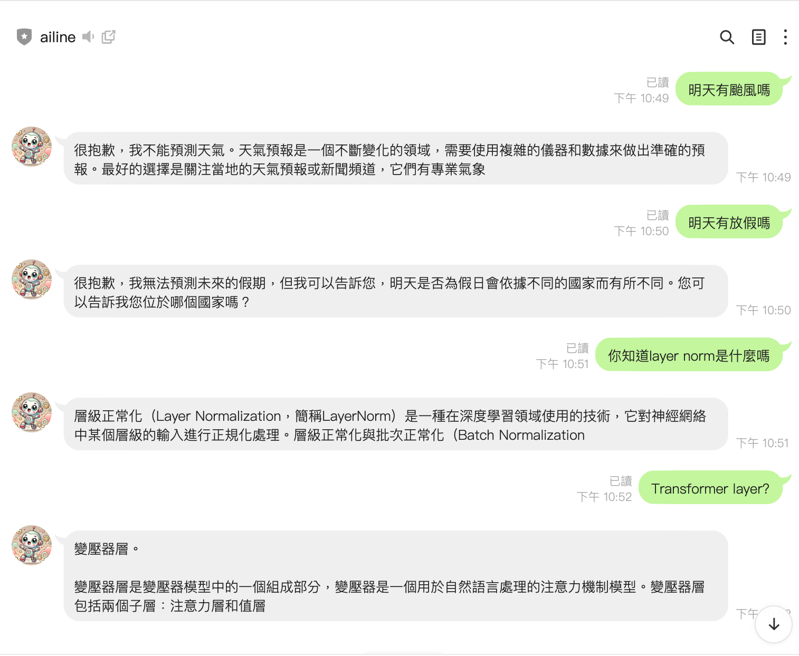

# LINE Bot 搭配 Cohere API 

這是一個使用 Flask 框架構建的 LINE 機器人，並加入了 Cohere API 來生成回覆。該機器人可以接收來自 LINE 的訊息，並使用 Cohere API 生成繁體中文或英文的回覆。

## 功能

- **接收 LINE 訊息**：接收來自 LINE 使用者的文本訊息。
- **生成回覆**：使用 Cohere API 生成回覆內容。
- **多語言支持**：回覆繁體中文或英文消息，並限制在 100 字以內。
- **文字訊息回覆**：支持回覆純文字訊息。

## 部署到 Render 保持後端運行

本機器人可部署到 [Render](https://render.com/) 平台，以確保後端持續運行。請參考 [Render 部署指南](https://render.com/docs/deploy-flask) 以獲取詳細步驟。

## 安裝指南

### 先決條件

在開始之前，請確保您已經具備以下條件：

- **Python**：版本 3.7 或以上
- **包管理工具**：pip 或 Poetry
- **LINE 開發者帳戶**：用於創建和管理 LINE 機器人
- **Cohere API 金鑰**：用於調用 Cohere 的自然語言處理服務

### 創建虛擬環境並安裝依賴

建議使用 **Poetry** 來管理虛擬環境和依賴：

1. **安裝 Poetry**（如果尚未安裝）：

    ```bash
    curl -sSL https://install.python-poetry.org | python3 -
    ```

2. **安裝依賴**：

    在項目根目錄下運行：

    ```bash
    poetry install
    ```

### 配置環境變量

為了保護敏感信息，請將它們存儲在環境變量中。

1. **創建 `.env` 文件**：

    在項目根目錄下創建一個名為 `.env` 的文件。

2. **添加以下內容**：

    ```env
    LINE_TOKEN= your LINE_CHANNEL_ACCESS_TOKEN
    LINE_SECRET= your LINE_CHANNEL_SECRET
    COHERE_API_KEY=your COHERE_API_KEY
    ```

    > **注意**：請將 `你的LINE_CHANNEL_ACCESS_TOKEN`、`你的LINE_CHANNEL_SECRET` 和 `你的COHERE_API_KEY` 替換為實際的金鑰和秘密。

### 運行應用

您可以選擇使用 Flask 內建的開發伺服器或 Gunicorn 來運行應用。

#### 使用 Flask 內建的開發伺服器

1. **設置 Flask 應用環境變量**：

    ```bash
    export FLASK_APP=app.py
    export FLASK_ENV=development  # 可選，用於啟用調試模式
    ```

2. **啟動 Flask 伺服器**：

    ```bash
    flask run
    ```

#### 使用 Gunicorn 部署

Gunicorn 是一個生產級的 WSGI HTTP 伺服器，適用於部署 Flask 應用。

1. **安裝 Gunicorn**（如果尚未安裝）：

    ```bash
    poetry add gunicorn
    ```

2. **啟動 Gunicorn 伺服器**：

    ```bash
    gunicorn --bind 0.0.0.0:10000 app:app
    ```

## 項目結構

以下是本項目的文件結構：

```bash
.
├── app.py               # 主應用程序
├── requirements.txt     # 依賴文件（如使用 pip）
├── pyproject.toml       # Poetry 配置文件
├── .env                 # 環境變量文件
├── vercel.json          # Vercel 配置文件（如有需要）
└── README.md            # 說明文件
```

### 添加我的 LINE 機器人

可以通過以下步驟添加我的 LINE 機器人：

1. **打開 LINE 應用**。
2. **點擊「添加朋友」**。
3. **搜索我的 LINE ID**：`@417fukfq`。
4. **添加我的機器人為好友**，然後開始聊天！


### 實際使用


